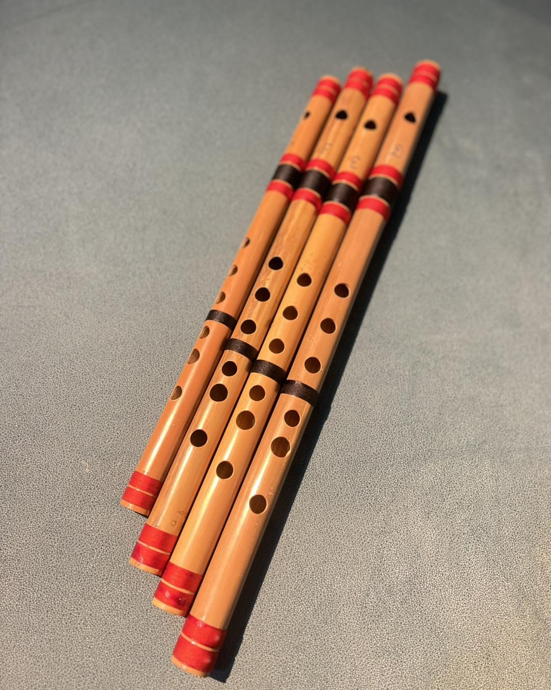
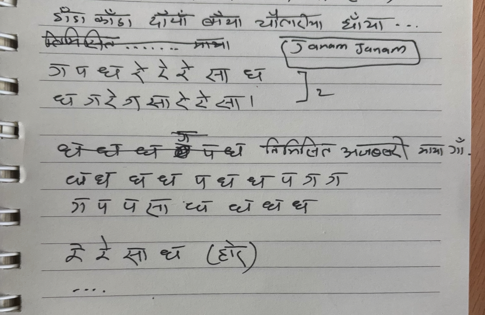

## How it started

Back in primary school, we had a subject called Creative Expression Art (सृजनात्मक अभिव्यक्ति कला). It sounds fancy, but really it was one of those rare classes where the school actually let you breathe. Our teacher for it was the kind of person you don't forget, calm, unhurried, and full of quiet skills. He could pick up a madal and make it speak, and when he put a flute to his lips, the whole classroom went still. There was something almost unfair about it that the way a simple tube of bamboo could carry a melody so effortlessly, like the tune it had always been living inside it, just waiting to be let out.

That image stayed with me. I bought a flute from a market stall sometime after, full of hope, but without a teacher or the internet to guide me, I got nowhere. The flute collected dust. The dream quietly shelved itself.

Then in 2022, I gave it another shot however this time with patience. I bought a new flute and made a small deal with myself: practice every day, no matter how ugly it sounds. For weeks it was just air and frustration. But slowly, something shifted. Notes started landing where I wanted them. A few months in, I played *Resham Firiri* from start to finish that old, eternal Nepali folk song and something in my chest loosened. After that, melodies started coming more naturally. The flute stopped feeling like a puzzle and started feeling like a voice. Now, when the evening gets quiet or my mind gets too loud, I just reach for it. A few breaths, a few notes, and the world slows down, I feel real, I can feel the nature, I can feel the breeze, I can feel the sun beams, I can feel the gentle dance of leaves, I feel godly.

## The flute itself

A traditional Nepali bamboo flute; simple in form, ancient in soul. <em>(Photo: Flute Nepal)</em>

There's something ancient about a bamboo flute. Across Asia, from the Himalayan hills of Nepal to the river plains of India to the misty forests of China, each region has shaped this instrument into its own image. In Nepal, ours is cut from a specific variety of bamboo, with holes bored into it in a particular pattern. The size of the tube, the spacing of the holes; all of it conspires to produce a certain voice. A wider flute hums low and warm; a thinner one rings out bright and piercing. The same idea, a hundred different souls.

As a kid I once tried carving one myself, convinced it couldn't be that hard. It was that hard. The one I have now I brought back from a music shop in Kathmandu, a small, unassuming instrument that has somehow traveled with me further than most things I own.

## Learning the notes

The flute doesn't let you cheat. It asks for your breath, your fingers, and your ear all at once; and if any one of them wanders, the melody collapses. In the beginning, it feels like trying to rub your stomach and pat your head while also humming a song. Your brain knows what it wants; your hands and mouth haven't gotten the memo yet.

But with time, something wonderful happens: your body starts to remember. The fingers learn their positions the way they learn a route walked a hundred times, without thinking, without looking. Once that muscle memory settles in, music stops being a problem to solve and becomes something closer to breathing. The notes just flow, one into the next, and somewhere in that flow a melody appears.

Notations for <em>Janam Janam Ko</em>; one of the first Nepali songs I learned to play.

Yet flute itself is very big art which takes decades to master it, I am very very noob player, I know nothing about music and notes and melody. 

## What it means to me

The flute has a kind of honesty that I love. There are no lyrics to hide behind, no words to carry the weight of what you're feeling. The melody has to do all of it — and somehow, it does. It leaves a wide open space in your mind, an empty canvas where your own thoughts and feelings can settle and take shape. Every listener hears something slightly different; every time I play, I feel something slightly different.

When I play outside or even just close my eyes and play — I feel it most strongly. The flute becomes one more voice in a larger conversation: the river below, the wind through the trees, the birds going about their evening. I'm not performing. I'm just adding one small thread to a sound that was already there. And in those moments, the distance between me and the hills I grew up near shrinks to nothing. I'm not in a room anymore. I'm somewhere older, quieter, and more whole.

  <iframe src="https://www.youtube.com/embed/fhuikPUZeIo" title="Me playing the Nepali bamboo flute" frameborder="0" allow="accelerometer; autoplay; clipboard-write; encrypted-media; gyroscope; picture-in-picture" allowfullscreen style="position:absolute;top:0;left:0;width:100%;height:100%;border:solid black;"></iframe>

Here I am, playing my bamboo flute.

